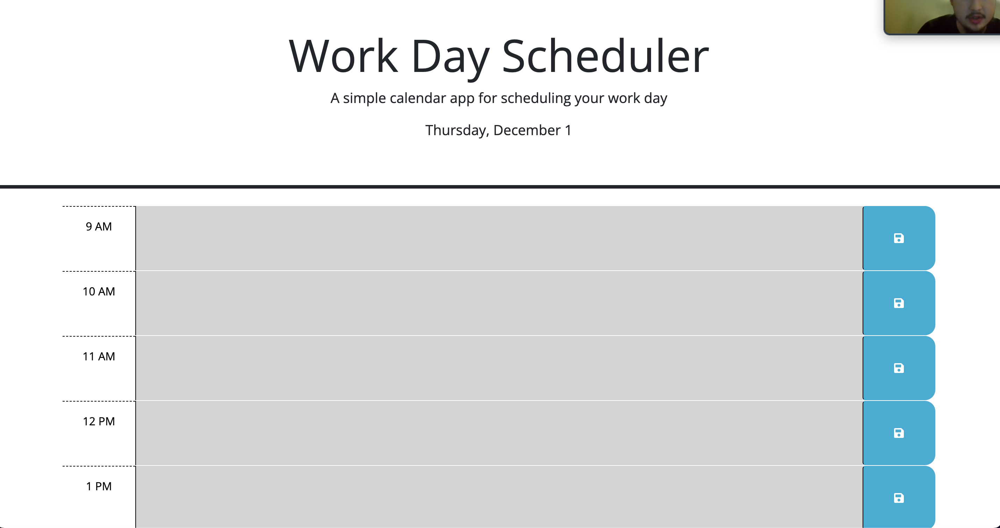
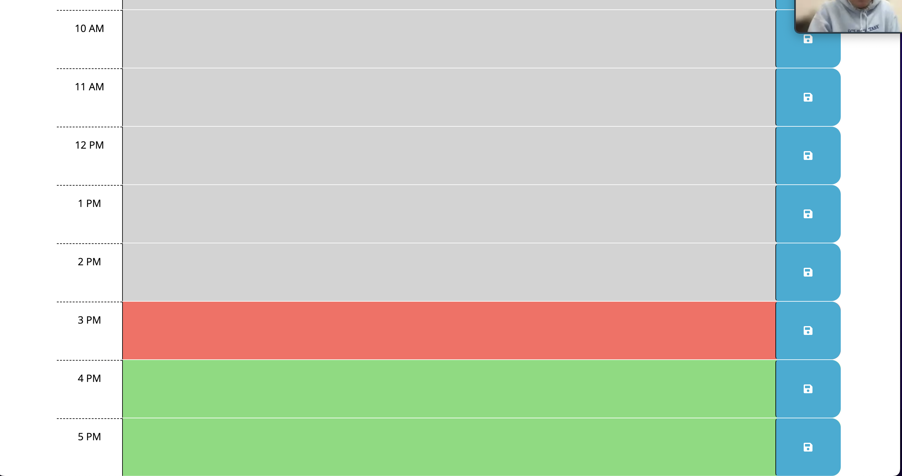

# Week 5 Challenge

## Github Pages
 https://andyabebaw.github.io/DailySchedule/
 
## Description

This website was built to serve as a way to keep track of your daily schedule.  It is color coded based on if a time block is
past, present, or future.  It also allows you to add and save a note item to any time block.

## Table of Contents (Optional)

- [Installation](#installation)
- [Usage](#usage)
- [Features](#features)

## Installation

1. Go To https://github.com/andyabebaw/DailySchedule
2. Copy the Git clone link using SSH.
3. In terminal on your local device, clone the repository using Git clone.
4. Open in Visual Studio.

## Usage

This website can be used to quiz yourself on CS topics.

## Features

- Color Coded Time Blocks Based on if it is past present or future
- The ability to save notes to any hour
- Todays Date displayed at the top of the page.

## How to Contribute

Follow the Installation Instructions above or click here: [Installation](#installation)
Make changes to index.html to add, remove, or change sections.  Edit the style.css to change the website appearance.  Also free to add new images in the images in images folder to be used on the site.
